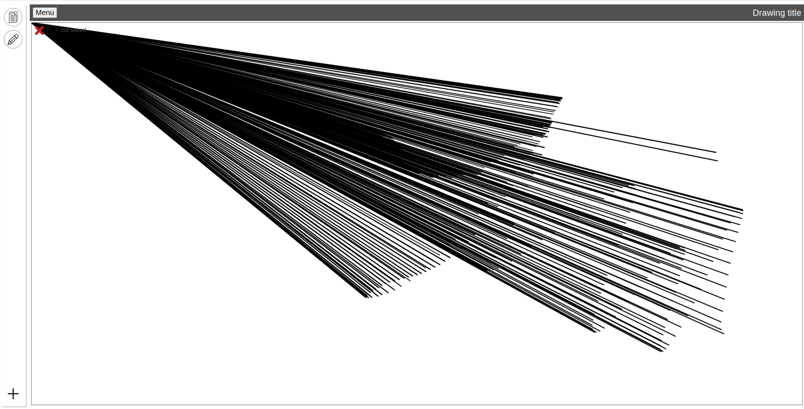
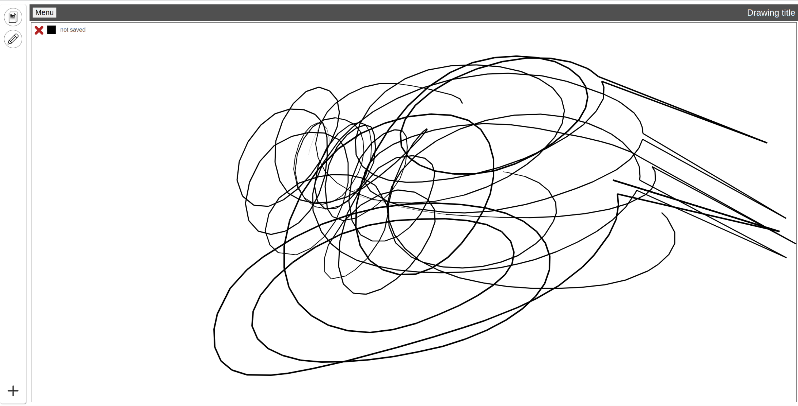
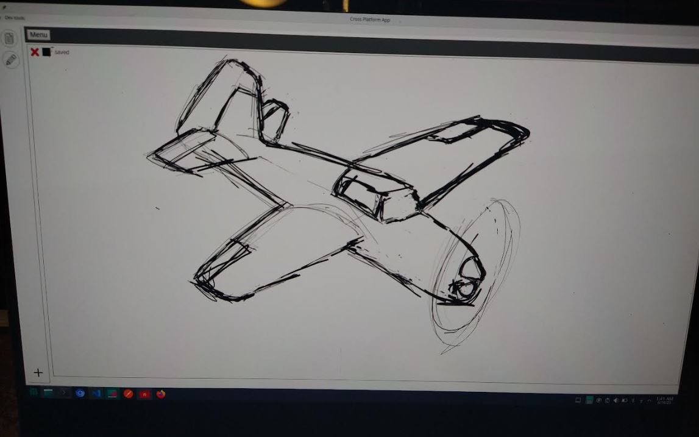
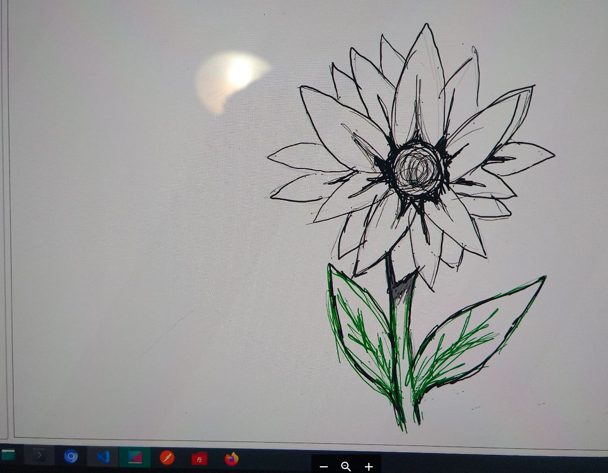
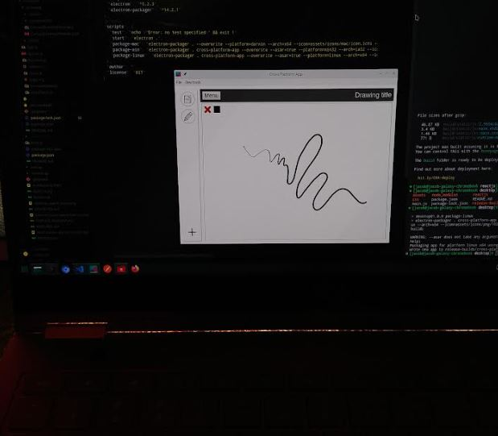

Desires

- [x] drawing app (06/15/2023)
    - got this great [starter code](https://stackoverflow.com/questions/2368784/draw-on-html5-canvas-using-a-mouse) here, figured out how to make it with my drawing tablet, this will be embedded for basic drawings
    - it'll be interesting figuring out how to save data
    - possible to save to image, looking into keeping drawing

06/17/2023

06/16/2023

11:45 PM

lol yeah that looks correct

11:59 PM

I'm obsessing over palm detection reeeeeeeeeeeeeeeee

12:00 AM

I wonder if it's a data origin thing

The db is not empty, but not sure if the data is just white or has stroke path

The canvas is not empty when I save, saving process is not failing...

as soon as I type it immediately saves, as I type the name, it has saved 5 times eg. t, t, te, tes, tes

I put a debouncer in...

12:05 AM

oh wait maybe I need to wait for an active drawing before having auto save work

12:23 AM

the saving stops working once the file gets big enough which is odd since it is not that big, it's under 100kb

12:27 AM

ohh... max URI length is 32KB

hmm I think I have to turn it into a picture, API takes the picture and turns it into a blob... and vice versa

1:25 AM

no I'm a dumbass TEXT max size is 64kb so it's cutoff, I need LONGTEXT

1:28 AM

alright... it's all good in the neighborhood, ooh control J is terminal

1:44 AM

ugh... the pressure is bad... keeps going to high pressure (thicker lines)

2:04 AM

it might be ElectronJS that's causing the problem... in browser only it's fine... idk

once I have the browser keyboard working I could use a browser tab

2:30 AM

trying new version of electronjs/packager

otherwise will settle for fixed stroke size

oh man that fixed it... who knew going from v8 to v25 would add new things lol

2:42 AM

ahh... I gotta get rid of those first contact dots...

It looks better though with the pen pressure working right

---

06/15/2023

Desires lol

Yeah I'm going to add the drawing app that I made it's over here separate repo

https://github.com/jdc-cunningham/drawing-notes-app

It's a piece of crap but works, has pressure support

6:22 PM

dang it... dealing with node-sass on win 10 right now, this branch need to remove

also thinking about app vs. web... specifically full screen for when in tablet mode/folded over

6:29 PM

oh no this one has an offset problem

well now is the time...

oh dang, when you load an image, have to clear existing canvas first

6:39 PM

nice fixed the offset

I gotta rebuild this for my SG 4K chromebook

6:51 PM

cool it's working

Can see pressure working, this is a desktop app made for Linux (Manjaro Arch)

6:53 PM

oh damn I forgot about the automatic saving

need to add that

7:17 PM

I'm obsessing over the first dot/pixel being the default color wth....

7:24 PM

I'm gonna have to move the API calls outside... in order to call them from the drawing ahh... kuso

7:59 PM

I'm stuck... have a weird situation where I need to trigger a method in the child from the parent

Do it with props but it doesn't always run

8:30 PM

oh dang the save API does not overwrite existing data, just appends oops

8:40 PM

need to fix the API real quick and then pull in these changes...

I really should make this an npm package or something vs. making changes in two places... or a git submodule maybe

9:00 PM

I gotta eat... but the max-width is off in electron

it overflows not sure why

9:12 PM

it's the wrapper selector

11:54 PM

the saving is not working and it saves too early while you're typing the name
