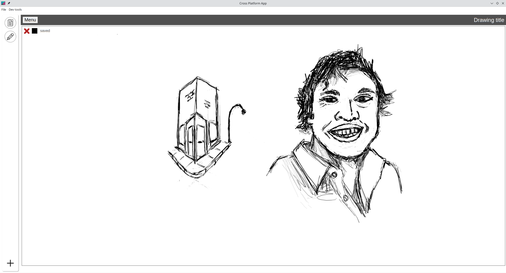

Desires

- [x] drawing app (06/15/2023)
    - got this great [starter code](https://stackoverflow.com/questions/2368784/draw-on-html5-canvas-using-a-mouse) here, figured out how to make it with my drawing tablet, this will be embedded for basic drawings
    - it'll be interesting figuring out how to save data
    - possible to save to image, looking into keeping drawing

06/17/2023

12:32 AM

I have to put time into the menu because it sucks...

previous search results still up, need the active drawing to determine what to save against vs. menu state

I'll probably fix that tomorrow first thing since it's a little harder than visually aligning keys on a keyboard

1:16 AM

holy crap the laptop runs hot while drawing lol, probably bad code

also this laptop is charging/fanless but yeah

It's that thing where an amateur drawer takes more strokes

The weight control is working for the most part or as far as I can tell

1:18 AM

oh yeah the main annoyance right now is the top of the electron window is draggable since it's a touchscreen and I sometimes hit that and minimize/hide/move the drawing app entirely

1:17 PM

alright back on

will rework the menu so it's not so jank

current problems

- if existing content, saves automatically or incorrectly

existing content as in the search term/tags are filled in

1:42 PM

I'm a little distracted, watching some YouTube, repositioned my plant cam

Looks like the mushroom that was growing in the plant died dang... it's a garden plot mushroom just random think it was in the dirt or maybe from the air? idk

1:47 PM

If I have a drawing down and I set a name it automatically saves... hmm, before I finish typing too so I get multiple entries with partial names

1:49 PM

when you load it doesn't auto save

1:52 PM

the other issue is too rapid of a save, multiple fire off at least two in a row

2:13 PM

ugh... this code is a cluster f already I mixed purposes, reworking it

2:50 PM

making some progress still a POS

topics search doesn't work

3:02 PM

oof... nasty alright, that's good for now, need to go back to keyboard then integrate it into this drawing app

3:04 PM

I'm going to switch to my desktop to develop the keyboard faster since it has a bigger screen TRAITOR!!!

4:45 PM

ehh... feeling bored, lazy

I got the keyboard done though so it can be pulled in/fire off the keys

I might have to actually map it to keyboard events

5:32 PM

poking at it...

5:45 PM

this is actually neat... a keyboard you can dynamically use/set the target against (where it types into)

5:58 PM

distracted

6:01 PM

firing off keyboard events seems problematic so I'll just have a top-most level string thing trickling down into any active text input

6:31 PM

distracted

I think I will use an object that has a key (input) then value, so that'll keep state of various text boxes

6:46 PM

had to update some stuff since code wouldn't parse right

7:09 PM

this is rough, I have to snake the state through so many places

9:23 PM

I'm going to try and integrate keyboard into the note pad part of this app

I want to be done with this and focus on doing other stuff... while using these tools

9:27 PM

oof my 3 year old code yuck

9:32 PM

nah I can't do this... I gotta trace the steps/modify stuff and I'm burnt

9:40 PM

ugh... the tablet mode changes the dimensions of the screen, will turn overflow off since it affects the Y offset

---

06/16/2023

11:45 PM

lol yeah that looks correct

11:59 PM

I'm obsessing over palm detection reeeeeeeeeeeeeeeee

12:00 AM

I wonder if it's a data origin thing

The db is not empty, but not sure if the data is just white or has stroke path

The canvas is not empty when I save, saving process is not failing...

as soon as I type it immediately saves, as I type the name, it has saved 5 times eg. t, t, te, tes, tes

I put a debouncer in...

12:05 AM

oh wait maybe I need to wait for an active drawing before having auto save work

12:23 AM

the saving stops working once the file gets big enough which is odd since it is not that big, it's under 100kb

12:27 AM

ohh... max URI length is 32KB

hmm I think I have to turn it into a picture, API takes the picture and turns it into a blob... and vice versa

1:25 AM

no I'm a dumbass TEXT max size is 64kb so it's cutoff, I need LONGTEXT

1:28 AM

alright... it's all good in the neighborhood, ooh control J is terminal

1:44 AM

ugh... the pressure is bad... keeps going to high pressure (thicker lines)

2:04 AM

it might be ElectronJS that's causing the problem... in browser only it's fine... idk

once I have the browser keyboard working I could use a browser tab

2:30 AM

trying new version of electronjs/packager

otherwise will settle for fixed stroke size

oh man that fixed it... who knew going from v8 to v25 would add new things lol

2:42 AM

ahh... I gotta get rid of those first contact dots...

It looks better though with the pen pressure working right

---

06/15/2023

Desires lol

Yeah I'm going to add the drawing app that I made it's over here separate repo

https://github.com/jdc-cunningham/drawing-notes-app

It's a piece of crap but works, has pressure support

6:22 PM

dang it... dealing with node-sass on win 10 right now, this branch need to remove

also thinking about app vs. web... specifically full screen for when in tablet mode/folded over

6:29 PM

oh no this one has an offset problem

well now is the time...

oh dang, when you load an image, have to clear existing canvas first

6:39 PM

nice fixed the offset

I gotta rebuild this for my SG 4K chromebook

6:51 PM

cool it's working

Can see pressure working, this is a desktop app made for Linux (Manjaro Arch)

6:53 PM

oh damn I forgot about the automatic saving

need to add that

7:17 PM

I'm obsessing over the first dot/pixel being the default color wth....

7:24 PM

I'm gonna have to move the API calls outside... in order to call them from the drawing ahh... kuso

7:59 PM

I'm stuck... have a weird situation where I need to trigger a method in the child from the parent

Do it with props but it doesn't always run

8:30 PM

oh dang the save API does not overwrite existing data, just appends oops

8:40 PM

need to fix the API real quick and then pull in these changes...

I really should make this an npm package or something vs. making changes in two places... or a git submodule maybe

9:00 PM

I gotta eat... but the max-width is off in electron

it overflows not sure why

9:12 PM

it's the wrapper selector

11:54 PM

the saving is not working and it saves too early while you're typing the name
