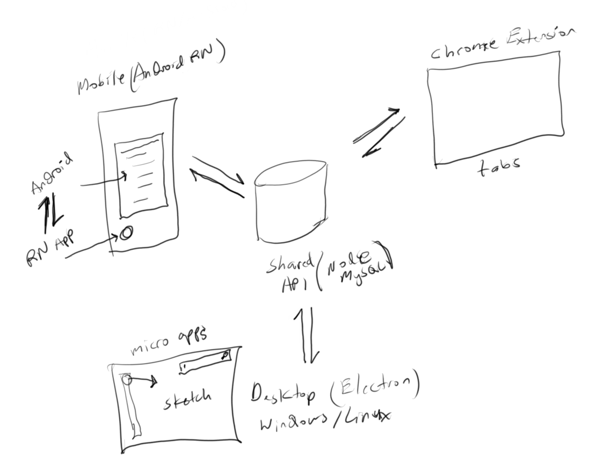
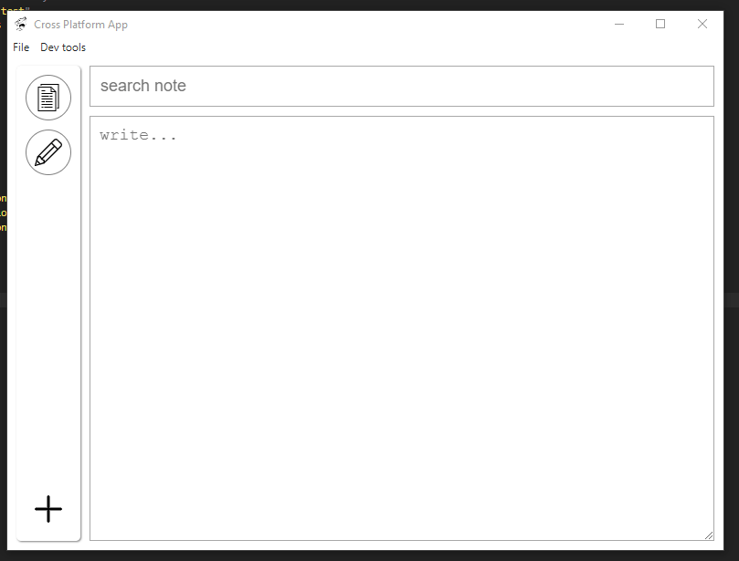
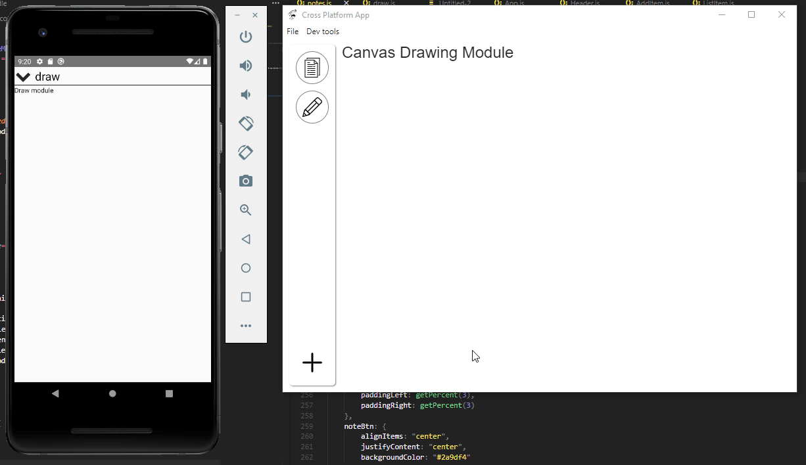

### About
This is a cross-platform note-taking app primarily along with some other "sub-apps" or "modules" sprinkled in eg. a canvas drawing tool that can be saved.

This is the intended functionality at minimum

### Technologies
* **Shared API** - `Node/Express/MySQL`
* **Desktop** - `Electron/ReactJS`
* **Mobile** - `React Native`

### API
This is the heart of these random connected apps. It is a remote API accessible by all the different apps eg. mobile/desktop/chrome extension. This one is written with `Node/Express/MySQL`. For me I use a VPS from [OVH](https://www.ovh.com/world/) so my API is remote in that it's not on my home network.

### Desktop
The desktop app is a `ReactJS` build loaded inside an `Electron` app.

#### Desktop - build/deploy
Within the `/desktop/` folder is a `/reactjs/` folder, in there you do your changes to the base `ReactJS` app then do your `npm run build`.
After that run `npm start` inside the `/desktop/` folder to run the Electron app. If all looks well, package it eg. `npm run package-win`.
Check `package.json` for the different packager options.
The executable file(s) will be in `/desktop/release-builds/` per platform you choose.

### Mobile
This is a React Native app, the apps are generally pretty basic, although built to be dynamic(can add more modules).
Below is a gif showing the Electron app updating some note and then the RN app reads the new value. Later RN updates same value and Electron sees it. Both interfaces are using the `/shared-api/` for modifying and storing data.

### Attributes
#### Icons sourced from Flaticon
* [Doc icon](https://www.flaticon.com/authors/monkik)
* [Pencil icon](https://www.flaticon.com/authors/those-icons)
* [Plus icon](https://www.flaticon.com/authors/pixel-perfect)