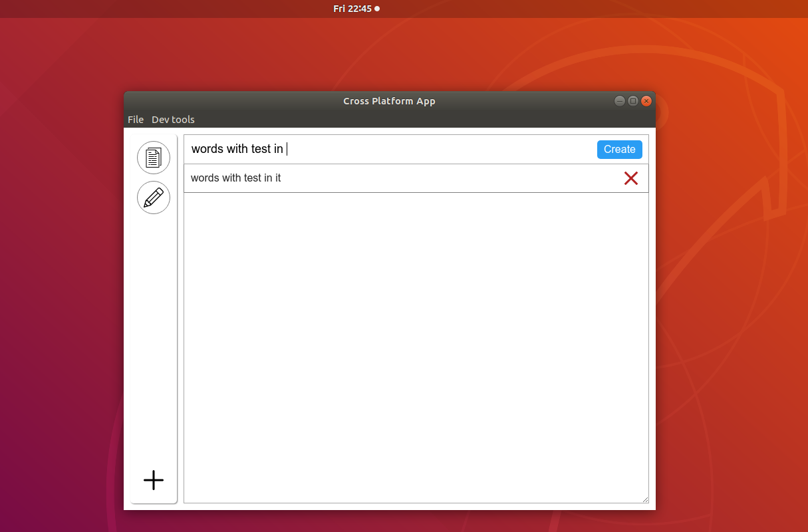

### About the desktop app
The desktop app is pretty much a `ReactJS` app build inside of `Electron`.

#### In Ubuntu
Note you have to run the app with `./cross-platform-app` by terminal, there are ways to make it run like an `.exe`

It's funny in laptop how slow it is compared to a wired, it literaly has the faked 1-2 second loading lag.

### The structure
The app structure is specifically designed to load "sub-apps" or "modules". The modules should be developed where they work in isolation and then they're just added into the modules folder/loaded by the dock component into the `app-window` based on the `activeApp` state.

### Development
You use the `/reactjs` folder then do your `npm run build`, the result `build` folder is imported by `electron` just by reference, it pulls the `index.html` file of the `ReactJS` project