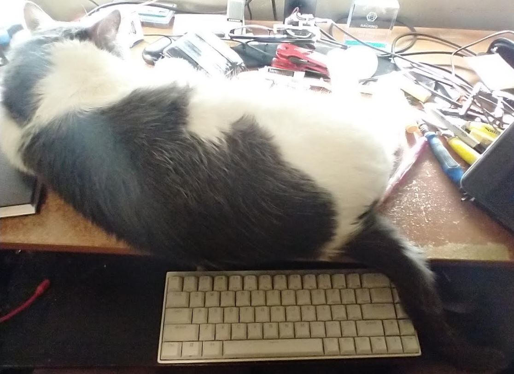

05/21/2023

5:29 PM

trying to just sh* this out this basic API endpoint to store tabs

ideally it's part of a cohesive note taking thing but that'll evolve over time like the drawing app

arguable it's a waste of time, use existing things like Trello vs. your own project manager

"mInE iS sPeCiAl"

5:46 PM

damn cat is in the window to absorb the sun, blinding light in my eyes

5:52 PM

I am struggling to do this... writing code becomes a chore after a while/not enjoyable

Maybe labor work will do me good

5:56 PM

ytf `dotenv`can't be found when installed with package json

man this folder setup is f'd

6:01 PM

his freaking tail keeps going over my mouse

6:04 PM

ugh... the deployed folder structure doesn't match this code ahh well

6:05 PM

pool is closed, oh no, I wanted to swim (ha)

6:08 PM

going to go back to what I had

6:26 PM

okay this API endpoint update is done... moving back to the extension
